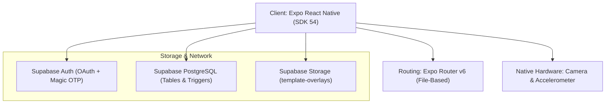
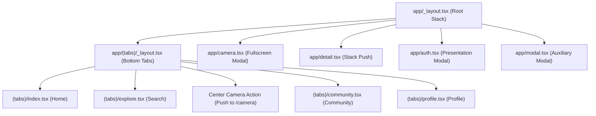
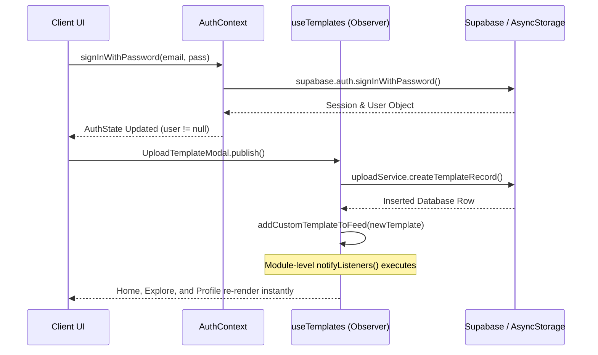
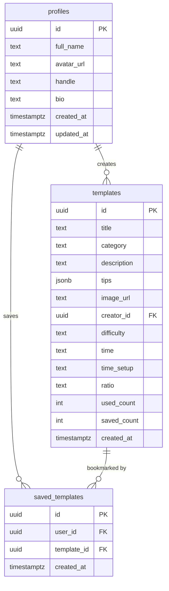

# PickSure — System & Technical Documentation

> **Version:** 1.0.0  
> **Target Platform:** Mobile (iOS, Android) & Simulated Web Viewport  
> **Core Framework:** Expo (SDK 54) / React Native 0.81 / React 19  
> **Backend Architecture:** Supabase (PostgreSQL 15, Auth, Storage, Edge RPC)  
> **Status:** Production-Grade Reference Specification  

---

## 1. Project Overview & SDLC Specification

### 1.1 Executive Summary

#### Problem Statement
Modern mobile smartphone cameras possess advanced optical hardware, yet non-professional photographers consistently struggle with framing, perspective, posture, and spatial composition. Casual subjects experience posing anxiety, while photographers often misjudge the horizon, rule-of-thirds alignment, or camera focal perspective. The visual discrepancy between reference inspiration photos found on social media and the actual captured outcome remains high due to the lack of real-time guided assistance at the moment of shutter release.

#### Target Audience
* **Casual Photographers & Solo Creators:** Individuals seeking effortless, repeatable editorial shots without expensive photography masterclasses or studio crews.
* **Content Creators & Influencers:** Creators producing daily Lookbook/OOTD, cafe lifestyle, and aesthetic travel media who rely on strict framing consistency.
* **Couples & Friends:** Casual shooters who want to direct their partners or companions to take exact, high-aesthetic poses without miscommunication.

#### Unique Value Proposition
PickSure transforms the mobile camera into an interactive directorial viewfinder through:
1. **Ghost Framing (Onion Skinning):** Renders high-fidelity semi-transparent reference outlines or photo overlays directly over the live native camera stream.
2. **Dynamic Geometric & Sensor Leveling:** Real-time accelerometer-driven horizon stabilization lines alongside rule-of-thirds composition scrims.
3. **Adaptive Ratio Framing:** Automatic aspect-ratio matching (`1:1`, `4:3`, `16:9`, `Full`) with post-capture hardware cropping to eliminate preview-to-storage geometry skew.
4. **Community Studio Network:** A synchronized ecosystem allowing creators to explore curated editorial guides, create multi-step templates, and sync bookmarks across devices.

---

### 1.2 Core Feature Breakdown

| Feature Module | Component / Hook Architecture | Primary Technical Mechanism | Target User Value |
| :--- | :--- | :--- | :--- |
| **Ghost Framing** | `app/camera.tsx`<br>`CameraFilterScrim.tsx`<br>`PoseSilhouette.tsx` | Viewport overlay with dual render modes (`outline` SVG vs `photo` reference) and granular opacity manipulation ($0\% - 100\%$). Layer passes through touch events using `pointerEvents="none"`. | Eliminates posing ambiguity by displaying exact body contours directly on top of the live subject. |
| **Sensor Horizon Leveling** | `hooks/useCameraControls.ts`<br>`expo-sensors` (`Accelerometer`) | Real-time trigonometric tilt computation sampled at 100ms intervals: $\theta = \operatorname{atan2}(x, \sqrt{y^2 + z^2}) \cdot \frac{180}{\pi}$. Dynamically changes line color to `#4EED97` with a `LEVEL ✓` badge when $\|\theta\| \le 2.5^\circ$. | Eliminates tilted, crooked horizons in street and landscape photos. |
| **Curated Discovery Feed** | `app/(tabs)/index.tsx`<br>`CategoryCarousel.tsx`<br>`TemplateFeedCard.tsx` | Virtualized masonry list using `@shopify/flash-list` with in-memory caching, category chip filtering, and image prefetching. | Delivers lag-free, responsive scrolling across hundreds of high-resolution photography templates. |
| **7 Canonical Categories** | `src/constants/categories.ts`<br>`app/(tabs)/explore.tsx` | Strongly typed category taxonomy with indexed SQL queries and category distribution counters. | Organizes guides into distinct visual aesthetics and shooting scenarios. |
| **5-Step Template Creator** | `components/UploadTemplateModal.tsx`<br>`services/uploadService.ts` | Multi-step form wizard with ratio auto-detection, local draft persistence via `AsyncStorage`, and binary upload to Supabase Storage. | Empowers creators to publish their own guides with zero friction. |
| **Session Gallery & Bookmarking** | `components/SessionGalleryModal.tsx`<br>`hooks/useBookmarks.ts` | Optimistic local UI updates coupled with remote Supabase `saved_templates` table upserts. Session photo array with fullscreen zoom modal. | Enables rapid shot review during shoots and seamless cross-device bookmark preservation. |

#### The 7 Canonical Categories
PickSure categorizes all photography composition guides into 7 canonical categories defined in [`src/constants/categories.ts`](file:///D:/picksure/picksure/src/constants/categories.ts):

```typescript
export const CATEGORIES = [
  'Cafe & Lifestyle',
  'OOTD & Streetwear',
  'Cottagecore & Nature',
  'Editorial & Noir',
  'Minimalist & Silhouette',
  'Casual & Mirror Check',
  'Couples & Friends',
] as const;

export type CategoryType = (typeof CATEGORIES)[number];
```

* **Cafe & Lifestyle:** Table settings, coffee mugs, candid conversational framing, and warm indoor lighting.
* **OOTD & Streetwear:** Low-angle movement shots, sneaker checks, geometric architectural backdrops, and urban leading lines.
* **Cottagecore & Nature:** Sunlit meadows, forest paths, botanical framing, and misty outdoor depth-of-field.
* **Editorial & Noir:** High-contrast studio shadow play, geometric angles, moody low-key portraits, and monochromatic lighting.
* **Minimalist & Silhouette:** Golden hour archways, negative space composition, and stark backlit subject contours.
* **Casual & Mirror Check:** Smartphone elevator reflections, flash indoor captures, and spontaneous outfit checks.
* **Couples & Friends:** Golden hour interactive posing, candid motion laughter, and multi-subject balance.

---

### 1.3 Tech Stack Manifest



| Layer | Technology | Version | Purpose in Architecture |
| :--- | :--- | :--- | :--- |
| **Core Framework** | React Native / Expo | `0.81.5` / `~54.0.35` | Cross-platform runtime executing on modern New Architecture (`newArchEnabled: true`). |
| **Language & Typing** | TypeScript | `~5.9.2` | Strict end-to-end interface typing with database schema mirrors. |
| **Application Router** | Expo Router | `~6.0.24` | File-system-based native routing with typed route parameters and native modal stacks. |
| **Data Layer (BaaS)** | Supabase JS Client | `^2.110.7` | Client connection for PostgreSQL, Authentication, and Storage operations. |
| **Local Storage** | Expo SecureStore & AsyncStorage | `~15.0.8` / `2.2.0` | Dual-tier storage: SecureStore for auth tokens; AsyncStorage for drafts, UI preferences, and cache. |
| **Camera & Capture** | Expo Camera | `~17.0.10` | Native hardware camera interface (`CameraView`) supporting aspect ratio, flash, zoom, and capture. |
| **Sensor Subsystem** | Expo Sensors | `~15.0.8` | High-frequency accelerometer access for live device pitch/roll computation. |
| **Image Pipeline** | Expo Image & Image Manipulator | `~3.0.11` / `~14.0.8` | High-performance memory-disk cached rendering, background prefetching, and ratio cropping. |
| **List Virtualization**| Shopify FlashList | `2.0.2` | High-throughput recycled item renderer for masonry exploration feeds. |
| **Vector Graphics** | React Native SVG | `15.12.1` | Rule-of-thirds guidelines and custom dynamic silhouette vector overlays. |
| **Animations** | React Native Reanimated & Animated | `~4.1.1` | Shutter pulse loops, toast transitions, and viewfinder layout springs. |

---

## 2. System Architecture & Component Hierarchy

### 2.1 File & Directory Map

```text
picksure/
├── app/                               # Expo Router file-system routes
│   ├── (tabs)/                        # Persistent bottom tab navigation group
│   │   ├── _layout.tsx                # Custom bottom navigation bar with elevated center shutter
│   │   ├── index.tsx                  # Discover Feed (Search, categories, FlashList masonry)
│   │   ├── explore.tsx                # Category Explorer with template counts & banner cards
│   │   ├── community.tsx              # Creator spotlight & recommended photographers
│   │   └── profile.tsx                # Studio profile, authenticated uploads, and saved bookmarks
│   ├── _layout.tsx                    # Root application entry: Font loading, Providers, Native Stack
│   ├── camera.tsx                     # Fullscreen viewfinder engine with Ghost Framing & HUD
│   ├── detail.tsx                     # Template inspection view with tips, wireframe & usage triggers
│   ├── auth.tsx                       # Modal authentication screen (Password, Google OAuth, OTP)
│   └── modal.tsx                      # Auxiliary modal container
├── components/                        # Modular, atomic UI components
│   ├── camera/                        # Viewfinder HUD and overlay controls
│   │   ├── CameraTopHud.tsx           # Back button, active guide metadata, ratio toggle, toasts
│   │   ├── CameraBottomControls.tsx   # Toggles (grid, mode, timer, flash), zoom selector, shutter
│   │   ├── CameraFilterScrim.tsx      # SVG rule-of-thirds grid, photo overlay, warm/noir filters
│   │   └── CameraOpacityControls.tsx  # Interactive opacity slider & eye visibility toggle
│   ├── home/                          # Home feed presentation components
│   │   ├── CategoryCarousel.tsx       # Horizontal scrolling category filter chips
│   │   ├── FeedHeader.tsx             # Search bar, active filters banner, featured hero card
│   │   ├── FeedFooter.tsx             # Pagination spinner, empty state messages, end-of-feed cues
│   │   └── TemplateFeedCard.tsx       # Masonry card with author metadata, likes, and save action
│   ├── upload/                        # 5-step guided creation modal components
│   │   ├── StepImagePicker.tsx        # Camera roll picker & live camera capture trigger
│   │   ├── StepCropRatio.tsx          # Aspect ratio selector with automatic Euclidean suggestion
│   │   ├── StepCategoryDetails.tsx    # Title, description, category, and difficulty selectors
│   │   ├── StepDirectorTips.tsx       # Multi-line director posing hints & gear advice
│   │   ├── StepReview.tsx             # Final pre-flight preview before cloud upload
│   │   └── GuestGateModal.tsx         # Auth interception modal prompting guests to register
│   ├── ui/                            # Shared interface primitives
│   │   ├── icon-symbol.tsx            # Cross-platform SF Symbol / Material icon adapter
│   │   └── collapsible.tsx           # Accordion animations
│   ├── PickSureLogo.tsx               # Vector brand monogram & typography mark
│   ├── PoseSilhouette.tsx             # Scalable vector silhouette paths for outline guide mode
│   ├── SessionGalleryModal.tsx        # Active shooting session carousel with sharing & delete
│   ├── SliderOpacity.tsx              # PanResponder/press-driven smooth opacity scrubber
│   ├── UploadTemplateModal.tsx        # Wizard state container with local draft management
│   ├── themed-text.tsx                # Theme-aware typography element
│   └── themed-view.tsx                # Theme-aware container element
├── constants/
│   └── theme.ts                       # Porcelain color tokens, viewfinder HUD tokens, Mali font map
├── context/
│   ├── AuthContext.tsx                # Global session provider with deep-link token interception
│   └── ThemeContext.tsx               # Dark/Light mode provider with AsyncStorage persistence
├── hooks/
│   ├── useBookmarks.ts                # Dual-layer bookmark synchronization with optimistic rollback
│   ├── useCameraControls.ts           # Ratio switching, sensor listening, zoom, timer, photo cropping
│   ├── useCameraPermissions.ts        # Camera/media library permission flow & settings deep-linking
│   ├── useTemplates.ts                # Paginated feed fetching, image prefetching, observer updates
│   ├── useTemplateSearch.ts           # Debounced search query & category filtering logic
│   └── use-theme-color.ts             # Adaptive color token resolution hook
├── lib/
│   ├── auth.ts                        # Google OAuth session opener, email/pass, OTP, timeout wrappers
│   └── supabase.ts                    # Supabase client instantiation with ExpoSecureStoreAdapter
├── services/
│   ├── templateService.ts             # Query templates table, parse tips JSON, count categories
│   └── uploadService.ts               # Storage binary upload (15MB limit) & DB record creation
├── src/
│   ├── constants/
│   │   ├── assets.ts                  # Static bundled images & fallbacks
│   │   └── categories.ts              # Canonical category strings and filter types
│   └── data/
│       └── templates.ts               # Local fallback template dataset & TypeScript models
├── types/
│   └── database.types.ts              # Auto-generated Supabase schema definitions
├── utils/
│   ├── cropMath.ts                    # Clamped bounding-box calculation for aspect ratio cropping
│   └── detectBestRatio.ts             # Euclidean nearest-neighbor image aspect ratio classifier
├── app.json                           # Expo app configuration, schemes, permissions, and plugins
├── eas.json                           # EAS Build profiles (development, preview, production)
└── package.json                       # Dependency tree and runtime scripts
```

---

### 2.2 Routing Architecture

The routing topology is managed by **Expo Router**, utilizing file-system conventions.



#### Route Definitions & Navigation Params

1. **Root Stack (`app/_layout.tsx`):**
   * Configures `SafeAreaProvider`, `AuthProvider`, and `ThemeProvider`.
   * Pre-loads the Google Mali font family via `useFonts`.
   * Sets stack presentation modes:
     * `(tabs)`: `headerShown: false` (Base interface).
     * `detail`: `headerShown: false` (Smooth stack push).
     * `camera`: `headerShown: false` (Fullscreen viewfinder experience).
     * `auth`: `presentation: 'modal', headerShown: false` (Slide-up credentials sheet).

2. **Bottom Tabs Navigation (`app/(tabs)/_layout.tsx`):**
   * Features a custom `tabBar` component wrapping a floating bottom dock.
   * **Custom Center Shutter Button:** Elevated by `marginTop: -20`, styled with deep plum (`#843C54`) and a rose inner ring (`#FFB9C8`), executing `router.push('/camera')`.
   * Navigation links:
     * `index.tsx`: `/` or `/(tabs)` — Home feed. Accepts query params: `{ category?: string, openSearch?: string }`.
     * `explore.tsx`: `/(tabs)/explore` — Category browser.
     * `community.tsx`: `/(tabs)/community` — Creator spotlight.
     * `profile.tsx`: `/(tabs)/profile` — User studio and saved bookmarks.

3. **Camera Screen (`app/camera.tsx`):**
   * Parameter contract: `useLocalSearchParams<{ id?: string, templateId?: string }>()`.
   * Reads passed template identifier to mount the corresponding ghost guide. If no parameter is provided, it defaults to free shooting mode or the first available guide.

4. **Detail Screen (`app/detail.tsx`):**
   * Parameter contract: `useLocalSearchParams<{ id: string }>()`.
   * Fetches template details, displays SVG pose silhouettes, photography tips, and increments usage stats upon clicking "Use Template".

---

### 2.3 State & Context Layer

The state management architecture combines React Context for persistent session identity with a module-level Observer pattern for real-time, low-overhead cross-screen synchronization.



#### 1. AuthContext (`context/AuthContext.tsx`)
* Manages the lifecycle of `user: User | null` and `session: Session | null`.
* Subscribes to `supabase.auth.onAuthStateChange` to capture login, token refresh, and sign-out events.
* Listens to external deep-linking events via `Linking.addEventListener('url', handleDeepLink)` to capture OAuth redirect tokens formatted as `#access_token=...&refresh_token=...`.
* Integrates `withTimeout` guards (10 seconds) to prevent UI deadlocks in poor network conditions.

#### 2. Module-Level In-Memory Observer (`hooks/useTemplates.ts`)
React state is naturally scoped to component lifecycles. To prevent expensive full-feed re-fetches when navigating between Home, Detail, Camera, and Profile tabs:
* Global memory cache: `let cachedTemplates: Template[] = []`.
* Active subscribers: `let listeners: Array<(templates: Template[]) => void> = []`.
* Calling `addCustomTemplateToFeed(newTemplate)` unshifts the newly published template into `cachedTemplates` and invokes every registered listener:
  ```typescript
  function notifyListeners() {
    listeners.forEach((listener) => listener([...cachedTemplates]));
  }
  ```
* As a result, when a user publishes a template in a modal, the masonry feed in `index.tsx` displays the item immediately without layout jumps or network latency.

#### 3. Dual-Layer Bookmark Synchronizer (`hooks/useBookmarks.ts`)
* Provides instantaneous optimistic toggling.
* When a user taps bookmark:
  1. Local `cachedBookmarkedIds` set is immediately updated.
  2. UI triggers haptic feedback and toggles icon fill state.
  3. Action is persisted locally to `AsyncStorage` (`saved_template_<userId>_<templateId>`).
  4. If user is authenticated, an asynchronous upsert or delete is dispatched to Supabase `saved_templates`.
  5. If the network request fails, state rolls back gracefully.

---

## 3. Database Schema & Backend Implementation (Supabase)

### 3.1 Table Schemas

The database schema is deployed on PostgreSQL 15 via Supabase.



#### SQL Table Definitions

```sql
-- 1. Profiles Table (extends auth.users)
CREATE TABLE public.profiles (
    id UUID PRIMARY KEY REFERENCES auth.users(id) ON DELETE CASCADE,
    full_name TEXT,
    avatar_url TEXT,
    handle TEXT UNIQUE,
    bio TEXT,
    created_at TIMESTAMPTZ DEFAULT TIMEZONE('utc', NOW()) NOT NULL,
    updated_at TIMESTAMPTZ DEFAULT TIMEZONE('utc', NOW()) NOT NULL
);

-- 2. Templates Table
CREATE TABLE public.templates (
    id UUID PRIMARY KEY DEFAULT gen_random_uuid(),
    title TEXT NOT NULL,
    category TEXT NOT NULL,
    description TEXT,
    tips JSONB DEFAULT '[]'::jsonb,
    image_url TEXT NOT NULL,
    creator_id UUID REFERENCES public.profiles(id) ON DELETE SET NULL,
    difficulty TEXT CHECK (difficulty IN ('Beginner', 'Intermediate', 'Advanced')) DEFAULT 'Beginner',
    time TEXT DEFAULT '2 min',
    time_setup TEXT DEFAULT '2 min',
    ratio TEXT DEFAULT '3:4 RATIO',
    used_count INTEGER DEFAULT 0,
    saved_count INTEGER DEFAULT 0,
    created_at TIMESTAMPTZ DEFAULT TIMEZONE('utc', NOW()) NOT NULL
);

-- 3. Saved Templates Table (Bookmarking Junction)
CREATE TABLE public.saved_templates (
    id UUID PRIMARY KEY DEFAULT gen_random_uuid(),
    user_id UUID NOT NULL REFERENCES auth.users(id) ON DELETE CASCADE,
    template_id UUID NOT NULL REFERENCES public.templates(id) ON DELETE CASCADE,
    created_at TIMESTAMPTZ DEFAULT TIMEZONE('utc', NOW()) NOT NULL,
    CONSTRAINT unique_user_template_bookmark UNIQUE (user_id, template_id)
);

-- Performance Indexes
CREATE INDEX idx_templates_category ON public.templates(category);
CREATE INDEX idx_templates_created_at ON public.templates(created_at DESC);
CREATE INDEX idx_templates_creator_id ON public.templates(creator_id);
CREATE INDEX idx_saved_templates_user ON public.saved_templates(user_id);
CREATE INDEX idx_saved_templates_lookup ON public.saved_templates(user_id, template_id);
```

---

### 3.2 Security & Row-Level Security (RLS)

All public tables enforce Row-Level Security (`ALTER TABLE ... ENABLE ROW LEVEL SECURITY;`).

#### Exact RLS Policies

```sql
--------------------------------------------------------------------------------
-- PROFILES POLICIES
--------------------------------------------------------------------------------
ALTER TABLE public.profiles ENABLE ROW LEVEL SECURITY;

-- Anyone can view creator profiles
CREATE POLICY "Allow public read access on profiles"
ON public.profiles FOR SELECT
USING (true);

-- Authenticated users can update only their own profile
CREATE POLICY "Allow users to update own profile"
ON public.profiles FOR UPDATE
TO authenticated
USING (auth.uid() = id)
WITH CHECK (auth.uid() = id);

--------------------------------------------------------------------------------
-- TEMPLATES POLICIES
--------------------------------------------------------------------------------
ALTER TABLE public.templates ENABLE ROW LEVEL SECURITY;

-- Public read access: Anyone (guest or authenticated) can view templates
CREATE POLICY "Allow public read access on templates"
ON public.templates FOR SELECT
USING (true);

-- Authenticated creators can publish templates
CREATE POLICY "Allow authenticated users to insert templates"
ON public.templates FOR INSERT
TO authenticated
WITH CHECK (
    auth.uid() = creator_id OR creator_id IS NULL
);

-- Template creators can update their own guides
CREATE POLICY "Allow creators to update own templates"
ON public.templates FOR UPDATE
TO authenticated
USING (auth.uid() = creator_id)
WITH CHECK (auth.uid() = creator_id);

-- Template creators can delete their own guides
CREATE POLICY "Allow creators to delete own templates"
ON public.templates FOR DELETE
TO authenticated
USING (auth.uid() = creator_id);

--------------------------------------------------------------------------------
-- SAVED_TEMPLATES POLICIES
--------------------------------------------------------------------------------
ALTER TABLE public.saved_templates ENABLE ROW LEVEL SECURITY;

-- Users can only inspect their own bookmarks
CREATE POLICY "Allow users to read own saved templates"
ON public.saved_templates FOR SELECT
TO authenticated
USING (auth.uid() = user_id);

-- Users can bookmark templates for their own account
CREATE POLICY "Allow users to insert own bookmarks"
ON public.saved_templates FOR INSERT
TO authenticated
WITH CHECK (auth.uid() = user_id);

-- Users can remove their own bookmarks
CREATE POLICY "Allow users to delete own bookmarks"
ON public.saved_templates FOR DELETE
TO authenticated
USING (auth.uid() = user_id);
```

---

### 3.3 Stored Procedures, Triggers & RPC Functions

#### 1. Automatic User Profile Creation Trigger
Executes automatically whenever a user signs up via email/password, OTP, or Google OAuth.

```sql
CREATE OR REPLACE FUNCTION public.handle_new_user()
RETURNS TRIGGER AS $$
BEGIN
    INSERT INTO public.profiles (id, full_name, avatar_url, handle)
    VALUES (
        NEW.id,
        COALESCE(NEW.raw_user_meta_data->>'full_name', 'PickSure Creator'),
        NEW.raw_user_meta_data->>'avatar_url',
        LOWER(REPLACE(COALESCE(NEW.raw_user_meta_data->>'full_name', 'creator'), ' ', '_')) || '_' || SUBSTRING(NEW.id::text, 1, 5)
    )
    ON CONFLICT (id) DO NOTHING;
    RETURN NEW;
END;
$$ LANGUAGE plpgsql SECURITY DEFINER;

CREATE OR REPLACE TRIGGER on_auth_user_created
    AFTER INSERT ON auth.users
    FOR EACH ROW EXECUTE FUNCTION public.handle_new_user();
```

#### 2. Atomic Template Usage Increment (RPC)
Called directly from the mobile client (`app/detail.tsx`) when the user launches the camera with a template.

```sql
CREATE OR REPLACE FUNCTION public.increment_template_usage(target_template_id UUID)
RETURNS VOID AS $$
BEGIN
    UPDATE public.templates
    SET used_count = COALESCE(used_count, 0) + 1
    WHERE id = target_template_id;
END;
$$ LANGUAGE plpgsql SECURITY DEFINER;
```

#### 3. Automatic Bookmark Counter Synchronization Trigger
Maintains `templates.saved_count` consistency in real-time when rows are inserted or deleted in `saved_templates`.

```sql
CREATE OR REPLACE FUNCTION public.sync_template_saved_count()
RETURNS TRIGGER AS $$
BEGIN
    IF TG_OP = 'INSERT' THEN
        UPDATE public.templates
        SET saved_count = COALESCE(saved_count, 0) + 1
        WHERE id = NEW.template_id;
        RETURN NEW;
    ELSIF TG_OP = 'DELETE' THEN
        UPDATE public.templates
        SET saved_count = GREATEST(COALESCE(saved_count, 1) - 1, 0)
        WHERE id = OLD.template_id;
        RETURN OLD;
    END IF;
    RETURN NULL;
END;
$$ LANGUAGE plpgsql SECURITY DEFINER;

CREATE OR REPLACE TRIGGER on_template_bookmark_change
    AFTER INSERT OR DELETE ON public.saved_templates
    FOR EACH ROW EXECUTE FUNCTION public.sync_template_saved_count();
```

---

### 3.4 Storage Bucket Architecture

* **Bucket Name:** `template-overlays`
* **Public Visibility:** `true` (Enables low-latency CDN image retrieval without time-limited signed URLs).
* **Storage Path Hierarchy:**  
  `templates/{creator_id}/{timestamp}.{ext}`  
  *(Guest uploads fallback to `templates/guest/{timestamp}.{ext}`)*
* **Allowed Extensions:** `.jpg`, `.jpeg`, `.png`, `.webp`, `.heic`
* **Maximum File Size Limit:** `15,728,640 bytes` (15MB), enforced via `services/uploadService.ts` before binary stream dispatch.

#### Storage Bucket Policies

```sql
-- Public read access for all assets in template-overlays
CREATE POLICY "Public Access template-overlays"
ON storage.objects FOR SELECT
USING (bucket_id = 'template-overlays');

-- Authenticated creators can upload assets to template-overlays
CREATE POLICY "Authenticated users can upload template overlays"
ON storage.objects FOR INSERT
TO authenticated
WITH CHECK (
    bucket_id = 'template-overlays' AND
    (storage.foldername(name))[1] = 'templates'
);
```

---

## 4. Design System & UI Tokens

### 4.1 Visual Language: Warm Porcelain & Deep Plum

PickSure implements a boutique, warm editorial aesthetic that moves away from generic cold monochrome interfaces.

| Token Identifier | Hex / RGBA Value | Semantic Usage |
| :--- | :--- | :--- |
| `background` | `#FAF7F2` | Warm porcelain canvas background across all primary screens. |
| `surface` | `#F3EFEA` | Secondary container surface, card background, input backdrop. |
| `surfaceAlt` | `#FFFFFF` | Elevated cards, modal dialogs, crisp card cutouts. |
| `border` | `#E7E2D9` | Subtle separator borders, card boundary strokes. |
| `borderLight` | `#EBE6DF` | Minimal dividing rules, subtle chip boundaries. |
| `primaryDark` / `plum` | `#843C54` | Primary brand accent: Active tabs, primary buttons, hero badges. |
| `burgundyLight` | `#753449` | Pressed button states, dark gradient stops. |
| `primary` / `rosePrimary`| `#F7A0B8` | Signature rose pink: HUD highlights, camera shutter ring. |
| `primarySoft` / `roseSoft` | `#FFB9C8` | Tinted icon containers, subtle badge backgrounds. |
| `textPrimary` | `#1A1817` | High-contrast deep studio charcoal for primary titles. |
| `textSecondary` | `#524346` | Editorial subtitles, body copy, card metadata. |
| `textMuted` | `#857376` | Timestamp text, inactive tab items, secondary icons. |
| `textLight` | `#FAF7F2` | Inverted light text rendered against dark HUD surfaces. |

#### Typography Tokens (`constants/theme.ts`)
The application utilizes the **Mali** Google font family, delivering an approachable yet refined editorial feel:

```typescript
export const Fonts = {
  regular: 'Mali-Regular',       // 400 - Body copy, descriptions
  medium: 'Mali-Medium',         // 500 - Form inputs, button labels
  semiBold: 'Mali-SemiBold',     // 600 - Category chips, tab labels
  bold: 'Mali-Bold',             // 700 - Screen headers, guide titles
  extraLight: 'Mali-ExtraLight', // 200 - Stylized editorial captions
  light: 'Mali-Light',           // 300 - Secondary subtitles
  italic: 'Mali-Italic',         // 400 Italic - Director quote tips
};
```

---

### 4.2 Viewfinder Dark HUD Exception

While the exploration and profile screens utilize the Warm Porcelain `#FAF7F2` theme, the live camera viewfinder (`app/camera.tsx`) operates under an intentional **Dark HUD Exception**.

#### Rationale
1. **Photometric Eye Comfort:** When looking through the camera preview, high-luminance white frames produce harsh screen glare that reflects off the subject's face in dim lighting and restricts the photographer’s visual dynamic range.
2. **Ghost Scrim Contrast:** Semi-transparent reference guides and white dashed composition vectors require a deep, low-luminance background (`#0D0C0A`) to ensure optimal edge visibility.

#### Dark HUD Tokens

| HUD Token | Value | Applied Element |
| :--- | :--- | :--- |
| `viewportLetterbox` | `#0D0C0A` | Outer letterbox letterboxing container behind 4:3 or 1:1 frames. |
| `viewportFrame` | `#161411` | Background of the active camera viewport. |
| `hudBackground` | `rgba(50, 48, 43, 0.75)` | Translucent background for top HUD & bottom control docks. |
| `hudSurface` | `rgba(50, 48, 43, 0.60)` | Circular quick-action buttons (Flash, Timer, Filter, Flip). |
| `hudBorder` | `rgba(231, 226, 217, 0.25)` | 1px border stroke around HUD containers and pills. |
| `levelerPerfect` | `#4EED97` | High-visibility emerald green indicating perfect horizon alignment ($\le 2.5^\circ$). |
| `gridLines` | `rgba(255, 204, 213, 0.5)`| Translucent rose dashed rule-of-thirds vector lines. |

---

### 4.3 Component Standards

#### 1. Tactile Shutter Assembly
The shutter button (`CameraBottomControls.tsx`) is designed with a multi-layered concentric tactile aesthetic:
* **Outer Pulsing Ring:** An `Animated.View` scaling between $1.0$ and $1.12$ in a 1200ms ease loop (`borderColor: Colors.primary`).
* **Solid Ring:** 72px diameter, 3px stroke with a 4px gap.
* **Inner Core Shutter:** 58px diameter solid `#FFFFFF` disk that morphs to soft rose (`#FFB9C8`) during active capture execution.

#### 2. Floating Navigation Dock
Configured in `app/(tabs)/_layout.tsx`:
* Renders inside `SafeAreaView edges={['bottom']}` to ensure zero obstruction by iOS home indicators or Android gesture bars.
* Fixed height: `58px`.
* Border top: `1px solid #E7E2D9`.
* Elevated center camera button: `58x58px` circle elevated `-20px` above the tab baseline, with an elevation of `6` and shadow radius of `8px`.

#### 3. Granular Opacity Scrubber (`SliderOpacity.tsx`)
* Custom drag/tap track supporting continuous values from $0$ to $100$.
* Preset snap chips: **Faint** ($25\%$), **Medium** ($55\%$), and **Solid** ($85\%$).
* Directly manipulates reference photo alpha channel: $\text{opacity} = \frac{\text{opacityValue}}{100} \cdot 0.55$.

---

## 5. Setup, Environment & Deployment Guide

### 5.1 Prerequisites

* **Node.js:** `v20.x` LTS (or `>= 18.18.0`).
* **Package Manager:** `npm` (v10+) or `yarn` (v1.22+).
* **Expo CLI:** Bundled via local dependency `npx expo`.
* **EAS CLI:** `npm install -g eas-cli` (v20.0.0+ for cloud builds).
* **Native Development Environment:**
  * **Android:** Android Studio Ladybug/Koala with Android SDK Platform 34 or 35, Android Build Tools, and NDK enabled.
  * **iOS (macOS only):** Xcode 16+ with CocoaPods installed and iOS 17/18 Simulator runtime.
  * **Expo Go Client:** Compatible with Expo SDK 54.

---

### 5.2 Environment Variables

Configuration keys are managed through project root environment files:

```bash
# Production / Local environment template (.env)
EXPO_PUBLIC_SUPABASE_URL=https://your-project-id.supabase.co
EXPO_PUBLIC_SUPABASE_ANON_KEY=eyJhbGciOiJIUzI1NiIsInR5cCI6IkpXVCJ9...
```

| Key | Usage & Scope | Required | Security Implication |
| :--- | :--- | :--- | :--- |
| `EXPO_PUBLIC_SUPABASE_URL` | Public endpoint for Supabase REST, Auth, and Storage APIs. | Yes | Safe to bundle in client binary; requests are guarded by Supabase RLS. |
| `EXPO_PUBLIC_SUPABASE_ANON_KEY` | Public client API key for accessing Supabase. | Yes | Enforces public/authenticated role constraints through PostgreSQL RLS policies. |

> [!IMPORTANT]
> The `EXPO_PUBLIC_` prefix is required by Expo Router so that variables are embedded into client JavaScript bundles at compile time. Never include service role keys in client environment files.

---

### 5.3 Local Run & Build Commands

#### Dependency Installation
```bash
# Clean install matching package-lock.json
npm install
```

#### Running the Development Server
```bash
# Launch Expo development bundler
npx expo start

# Clear bundler cache if switching branches or updating assets
npx expo start -c
```

#### Platform Targets
* **Web Browser:** Press `w` in terminal or run `npm run web`. Mounts simulated camera viewfinder.
* **Android Emulator / Device:** Press `a` or run `npm run android`.
* **iOS Simulator / Device:** Press `i` or run `npm run ios`.

#### Running Automated Unit Tests
```bash
# Execute Jest test suite (cropMath, detectBestRatio, uploadService, templateService)
npm test

# Run tests in watch mode
npm test -- --watch
```

#### EAS Build Profiles (`eas.json`)

```bash
# 1. Development Build (Includes native dev client & sensor debugging)
eas build --profile development --platform android
eas build --profile development --platform ios

# 2. Preview Build (Generates standalone APK for direct device distribution)
eas build --profile preview --platform android

# 3. Production Release Build (AAB for Google Play Store / IPA for Apple TestFlight)
eas build --profile production --platform all
```

---

### 5.4 Known Edge Cases & Troubleshooting

#### 1. Google OAuth Deep-Link Token Interception
* **Symptom:** User completes Google authentication in the external system browser, but the app does not automatically log in upon return.
* **Root Cause:** Deep link URL parsing fails if the application scheme `picksure://` is not registered in `app.json` or if hash parameters (`#access_token=...`) are not read.
* **Resolution:**
  1. Ensure `app.json` declares `"scheme": "picksure"`.
  2. `lib/auth.ts` uses `AuthSession.makeRedirectUri({ scheme: 'picksure' })` and invokes `WebBrowser.maybeCompleteAuthSession()`.
  3. `context/AuthContext.tsx` attaches a native event listener to `Linking.addEventListener('url', handleDeepLink)` to capture redirect parameters:
     ```typescript
     const accessToken = extractToken(url, 'access_token');
     const refreshToken = extractToken(url, 'refresh_token');
     if (accessToken && refreshToken) {
       await supabase.auth.setSession({ access_token, refreshToken });
     }
     ```

#### 2. Camera & Media Library Permission Denial
* **Symptom:** Screen remains stuck on "Camera Access Denied" even after user taps request button.
* **Root Cause:** On iOS and Android, once a user selects "Don't Allow" or "Never ask again", subsequent programmatic calls to `requestPermission()` immediately return denied without presenting a prompt dialog.
* **Resolution:** The `useCameraPermissions` hook detects this state via `status === PermissionStatus.DENIED && !canAskAgain`. When `isPermanentlyDenied` is true, the primary UI action dynamically changes to "Open Device Settings", calling `Linking.openSettings()`.

#### 3. Viewfinder Ratio Distortion vs Hardware Sensor
* **Symptom:** Image preview appears stretched or the saved photo contains more peripheral scene than was shown inside the viewfinder guide.
* **Root Cause:** Mobile camera hardware sensors natively capture at a fixed physical ratio (often 4:3 or 16:9). When a user selects 1:1 or 16:9, a standard uncropped capture preserves the sensor's native dimensions.
* **Resolution:** `hooks/useCameraControls.ts` executes post-processing via `cropPhotoToActiveRatio()`:
  ```typescript
  const crop = calculateCropRectangle(photoW, photoH, ratio);
  const manipResult = await ImageManipulator.manipulateAsync(
    photoUri,
    [{ crop }],
    { compress: 0.92, format: ImageManipulator.SaveFormat.JPEG }
  );
  ```
  This guarantees that the photo saved to the user's camera roll matches the viewfinder's framing boundaries.

#### 4. Metro Cache Stale Asset Manifests
* **Symptom:** Font load errors (`Mali-Regular not found`) or broken SVG assets after pulling upstream changes.
* **Resolution:** Execute a complete Metro and file watcher reset:
  ```powershell
  # Windows PowerShell
  npx expo start -c
  ```
